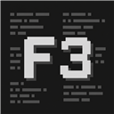

<p align="center">
  
</p>

# Nostalgic F3

A small client-side Fabric mod that restores the familiar Minecraft F3 layout: fixed columns, predictable ordering, and clean spacing, even when individual debug entries are disabled.

Use vanilla **Debug Options (F3 + F6)** to choose what appears. Nostalgic F3 has no configuration file and requires no Fabric API or configuration library.

## Features

- Keeps game and world information on the left, and memory, system specifications, and targeted objects on the right.
- Combines FPS, performance information, and GPU utilization into one neatly spaced line.
- Restores section-relative coordinates on the Block line.
- Restores the total-entity `T:` counter after particles, controlled by the vanilla particle entry.
- Groups target information and tags together, without gaps for empty targets.
- Keeps memory and mod information separated, without hardcoding individual mods.
- Fixes the rendered entity counter on Minecraft 1.21.x.
- Shows F3 behind menus while retaining vanilla F1 behavior.
- Gives newer vanilla entries consistent positions, including player speed in 26.3.
- Batches debug graphs and text backgrounds, and caches unchanged text preparation to reduce F3 rendering work.

Vanilla visibility settings, reduced debug information, measurements, charts, and keybinding hints are preserved. Performance information still works with FPS hidden, and day count can appear without local difficulty.

## Installation

1. Install [Fabric Loader](https://fabricmc.net/use/installer/) for your Minecraft version.
2. Download **one** matching Nostalgic F3 jar and place it in your Minecraft `mods` folder.
3. Launch Minecraft with Fabric and open F3.

This is a **client-only** mod. Servers do not need it.

| Jar target | Supported Minecraft versions | Minimum Fabric Loader | Game Java |
| --- | --- | --- | --- |
| 1.21.10 | 1.21.9, 1.21.10 | 0.17.3 | 21 |
| 1.21.11 | 1.21.11 | 0.17.3 | 21 |
| 26.1.2 | 26.1, 26.1.1, 26.1.2 | 0.18.4 | 25 |
| 26.2 | 26.2 | 0.18.4 | 25 |
| 26.3 | 26.3 | 0.18.4 | 25 |

Download the matching jar from the [1.0.0 release](https://github.com/S0urceDA/nostalgicf3/releases/tag/v1.0.0), or build from source using the instructions below.

The new F3 rendering optimizations are currently available in source builds. The existing 1.0.0 release downloads have not yet been refreshed.

## Building

Install JDK 21 and JDK 25. Run Gradle with JDK 25; legacy development clients use JDK 21. If Gradle cannot find both installations, set `JAVA_HOME_21_X64` and `JAVA_HOME_25_X64`, or pass their paths through `-Porg.gradle.java.installations.paths`.

Windows:

```powershell
.\gradlew.bat buildAll
```

Linux / macOS:

```sh
chmod +x gradlew
./gradlew buildAll
```

The five installable jars are written to `build/libs`. To launch a development client, run `./gradlew :26.3:runClient` (or `gradlew.bat` on Windows), substituting another jar target if needed.

`buildAll` includes layout regression checks and 12,000 randomized comparisons. `probeAll` additionally checks the actual Fabric/Mixin hooks on all five targets. Test and probe classes are excluded from release jars. After building, run `./gradlew -p compatibility-tests verifyAll` to check the packaged 1.21.10 jar on 1.21.9 and the packaged 26.1.2 jar on 26.1 and 26.1.1. These checks run the actual Mixin hooks and collector without opening a game window; they are also included in CI.

Shared layout code is in `src/shared/java`; version-specific mixins are generated from `src/client-template`. See [layout investigation](docs/INVESTIGATION.md) for development history and [performance notes](docs/PERFORMANCE.md) for the optimization measurements and their limits.

## Feedback

[Open an issue](https://github.com/S0urceDA/nostalgicf3/issues) with your Minecraft version, Fabric Loader version, mod version, and relevant mods. For layout problems, include a screenshot and the enabled Debug Options; for crashes, include the crash report or relevant log.

## Credits and license

Created by **S0urceDA**. Layout decisions were informed by OptiFine and Better Vanilla F3, with an independent implementation. No Minecraft, OptiFine, or Better Vanilla F3 source or binaries are included.

Released under [CC0-1.0](LICENSE).
